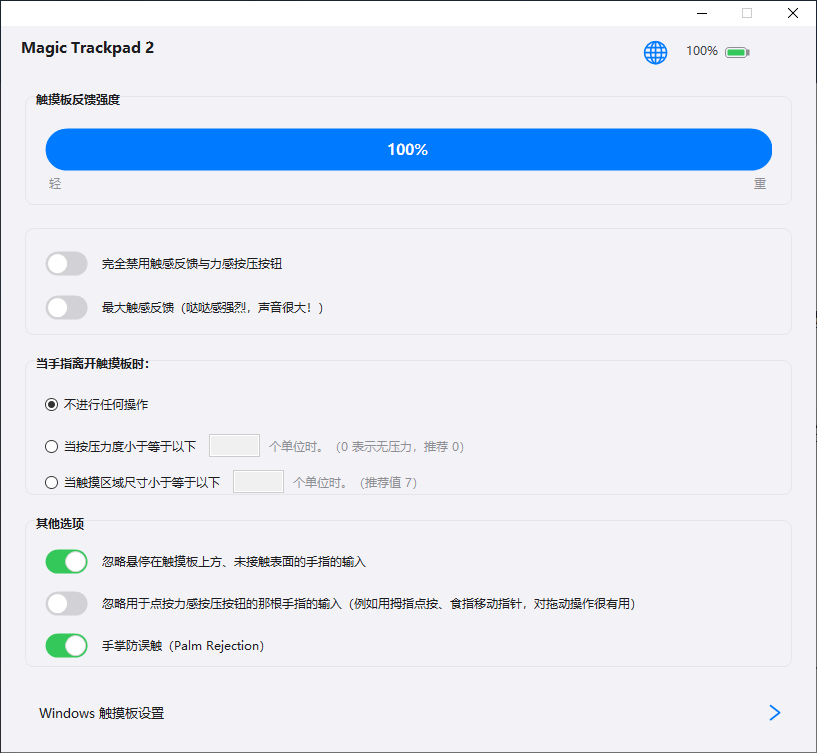

# Magic Trackpad 2 for Windows 中文版

苹果 Magic Trackpad 2 在 Windows 10 / Windows 11 下的精确式触摸板驱动完整安装包，
附带功能完整的中文控制面板（反馈强度无级调节、手掌防误触、电量显示、双语界面等）。

> **致谢与声明**：驱动本体（`AMD64\` 目录与证书）来自社区维护的 MagicTrackpad2ForWindows
> 项目（基于 imbushuo 开源驱动的工作分支），版权归原作者所有，感谢他们的付出。
> 本仓库的主要原创内容是 `src\` 下的中文控制面板源码、一键安装脚本与文档。

## 界面预览

<p align="center">
  
</p>

## 文件结构

```
├── AMD64\                        驱动本体（inf / cat / dll / sys）
├── MagicTrackpad2ForWindows.cer  驱动作者自签证书
├── Install-Driver.bat            一键安装脚本（导入证书 + pnputil 安装驱动）
├── Magic Trackpad2 For Windows.exe 中文控制面板（编译好的成品）
├── app.ico                       面板图标
├── 使用说明.txt                   快速上手说明
└── src\                          控制面板 C# 源码（WinForms，单文件编译）
```

## 全新系统快速开始

1. 右键 `Install-Driver.bat` → **以管理员身份运行**，等两步都提示成功
   （脚本会自动把作者证书导入受信任的根存储区，再用 pnputil 安装驱动）
2. 打开蓝牙配对 Magic Trackpad 2；或直接用数据线连接
3. 运行 `Magic Trackpad2 For Windows.exe`（自动请求管理员权限），按需调整

> 若触摸板之前已配对但装完驱动没反应：删除蓝牙配对记录后重新配对一次即可。

## 控制面板功能

- 顶部实时显示Magic Trackpad 2电量百分比
- 反馈强度 **0–100% 无级调节**（分段线性映射到驱动三档工厂预设之间，松手自动保存并即时生效）
- 完全禁用触感反馈 / 最大反馈强度“哒哒”模式 
- 手指离开触摸板时的指针停止条件（不停止 / 按压力度 / 按接触面积）
- 忽略悬停手指、忽略按压按键的手指（拇指点按 + 食指移动 = 好用的拖拽）、手掌防误触
- 中英文一键切换；所有改动写入注册表后通过 IOCTL 通知驱动热重载，无需重启

## 🔋 给作者的 Trackpad 也充个电

你的触摸板电量 +1%，作者的幸福电量也 +1%。金额随意，扫码即充～

<p align="center">
  
</p>

*打赏自愿，不影响任何功能使用。*


